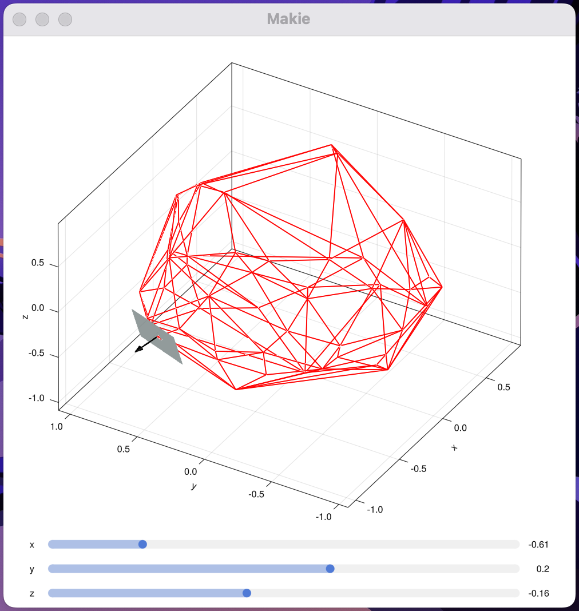

# Inner Product Maximization in 3 Dimensions

## About

Four different data structures solving [this task](https://cstheory.stackexchange.com/questions/34503/maximizing-inner-product) with $d=3$.

## Usage

### Basic Usage

```julia
using GeometryBasics, InnerProductMax # this may take a while ...
const T = Float64
const P3 = Point3{T}

point_set = tetrahedron(T) # initialize a non-degenerate 3xn point set
display(point_set) # 3x5
hull = Hull(point_set) # construct 3D hull
ds = InnerProductMaxMine{T, PointLocationDsTreap}(hull) # initialize inner product maximization data structure
display(query_all(ds, vec_to_matrix(P3[P3(3, 1, 2), P3(-3, -1, -2)]))) # query max vector
# 3×2 Matrix{Float64}:
#  1.0  0.0
#  0.0  0.0
#  1.0  0.0
```

### Interactive Plot

This will open a new window.

```julia
using InnerProductMax
const T = Float64

point_set = unit_sphere(T, 50)
make_interactive_plot(InnerProductMaxMine{T, PointLocationDsTreap}, point_set) # initializing GLMakie may take a while ...
```

Example:




### Subclasses of `AbstractInnerProductMax{T}`

Listed from best to worst complexity.

| Subclass                                      | Preprocessing Time | Preprocessing Memory | Query Time  |
| --------------------------------------------- | ------------------ | -------------------- | ----------- |
| InnerProductMaxNaive{T}                       | $O(N)$             | $O(N)$               | $O(N)$      |
| InnerProductMaxMine{T,PointLocationDsTreap}   | $O(N\log N)$       | $O(N\log N)$         | $O(\log N)$ |
| InnerProductMaxMine{T,PointLocationDsRB}      | $O(N\log N)$       | $O(N)$               | $O(\log N)$ |
| InnerProductMaxNested{T}                      | $O(N)$             | $O(N)$               | $O(\log N)$ |
 
In practice, for a hull of size $N\approx 10^5$, `InnerProductMaxMine{T,PointLocationDsTreap}` is the fastest in terms of query time, while `InnerProductMaxMine{T,PointLocationDsRB}` has slightly lower preprocessing time and memory but slightly larger query time.

## Dev Instructions

Add these to `startup.jl`: `using Revise, ReTest`. Run these commands from the repo root to execute all tests:

```
julia --project
include("test/InnerProductMaxTests.jl"); retest()
```

## Performance Tests 

```
include("test/InnerProductMaxTests.jl"); retest("sphere_perf")
```

Results:

```
         N       Q Method  Preproc Time (s)  Preproc Memory (MB)  Query Time (s)
0     1000    1000  Naive          0.000017             0.088208        0.002308
1     1000    1000   Mine          0.010655             8.234688        0.003923
2     2000    2000  Naive          0.000092             0.176208        0.008973
3     2000    2000   Mine          0.023383            17.890672        0.003160
4     5000    5000  Naive          0.000276             0.440208        0.046815
5     5000    5000   Mine          0.081375            48.884608        0.017122
6    10000   10000  Naive          0.000646             0.880208        0.204886
7    10000   10000   Mine          0.321766           102.224256        0.022775
8    20000   20000  Naive          0.001080             1.760208        0.712584
9    20000   20000   Mine          0.370499           210.870496        0.056952
10   50000   50000  Naive          0.003199             4.400208        4.347602
11   50000   50000   Mine          0.841139           562.539104        0.189053
12  100000  100000  Naive          0.008528             8.800208       29.408380
13  100000  100000   Mine          4.712876          1162.170496        0.430899
```

Red-black tree (memory is worse for some reason ...)

```
       N      Q                                             Method  Preproc Time (s)  Preproc Memory (MB)  Query Time (s)
0   1000   1000                                     Naive{Float64}          0.000030             0.088208        0.001731
1   1000   1000  Mine{Float64, InnerProductMax.PLRB.PointLocati...          0.836934            30.685142        0.002265
2   2000   2000                                     Naive{Float64}          0.000093             0.176208        0.008567
3   2000   2000  Mine{Float64, InnerProductMax.PLRB.PointLocati...          0.127989            43.213336        0.005933
4   5000   5000                                     Naive{Float64}          0.000293             0.440208        0.057106
5   5000   5000  Mine{Float64, InnerProductMax.PLRB.PointLocati...          0.294365           111.242704        0.017334
6  10000  10000                                     Naive{Float64}          0.000544             0.880208        0.184570
7  10000  10000  Mine{Float64, InnerProductMax.PLRB.PointLocati...          0.903501           233.486320        0.099521
8  20000  20000                                     Naive{Float64}          0.008901             1.760208        0.722730
9  20000  20000  Mine{Float64, InnerProductMax.PLRB.PointLocati...          1.334035           482.795608        0.110320
```

After some optimization:

```
         N       Q                                             Method  Preproc Time (s)  Preproc Memory (MB)  Query Time (s)
0     1000    1000                                     Naive{Float64}          0.000018             0.088208        0.002407
1     1000    1000  Mine{Float64, InnerProductMax.PLRB.PointLocati...          0.036450             7.696784        0.001469
2     2000    2000                                     Naive{Float64}          0.000068             0.176208        0.007784
3     2000    2000  Mine{Float64, InnerProductMax.PLRB.PointLocati...          0.169119            16.005184        0.017737
4     5000    5000                                     Naive{Float64}          0.000295             0.440208        0.060403
5     5000    5000  Mine{Float64, InnerProductMax.PLRB.PointLocati...          0.166669            40.568920        0.011874
6    10000   10000                                     Naive{Float64}          0.000654             0.880208        0.208089
7    10000   10000  Mine{Float64, InnerProductMax.PLRB.PointLocati...          0.263313            84.020904        0.019850
8    20000   20000                                     Naive{Float64}          0.000946             1.760208        0.854989
9    20000   20000  Mine{Float64, InnerProductMax.PLRB.PointLocati...          0.612379           161.643320        0.054820
10   50000   50000                                     Naive{Float64}          0.003221             4.400208        4.820060
11   50000   50000  Mine{Float64, InnerProductMax.PLRB.PointLocati...          1.845995           408.716920        0.180039
12  100000  100000                                     Naive{Float64}          0.007666             8.800208       21.956377
13  100000  100000  Mine{Float64, InnerProductMax.PLRB.PointLocati...          4.109249           820.536728        1.290055
```

Preprocessing time and memory are only slightly less than for treap. Perhaps the constant factor can be improved with more effort.

Note: We can significantly reduce the constant factor for queries using an optimization suggested in the paper.

```
         N       Q                                             Method  Preproc Time (s)  Preproc Memory (MB)  Query Time (s)
0     1000    1000                                     Naive{Float64}          0.000040             0.088208        0.001708
1     1000    1000  Mine{Float64, InnerProductMax.PLRB.PointLocati...          0.030870             7.476016        0.001962
2     2000    2000                                     Naive{Float64}          0.000072             0.176208        0.008648
3     2000    2000  Mine{Float64, InnerProductMax.PLRB.PointLocati...          0.062812            15.480224        0.002720
4     5000    5000                                     Naive{Float64}          0.000287             0.440208        0.053640
5     5000    5000  Mine{Float64, InnerProductMax.PLRB.PointLocati...          0.308152            39.286704        0.011566
6    10000   10000                                     Naive{Float64}          0.000798             0.880208        0.240438
7    10000   10000  Mine{Float64, InnerProductMax.PLRB.PointLocati...          0.362468            81.181088        0.023628
8    20000   20000                                     Naive{Float64}          0.001247             1.760208        0.788075
9    20000   20000  Mine{Float64, InnerProductMax.PLRB.PointLocati...          1.196662           156.532464        0.172948
10   50000   50000                                     Naive{Float64}          0.002310             4.400208        5.471993
11   50000   50000  Mine{Float64, InnerProductMax.PLRB.PointLocati...          2.251654           395.703808        0.237956
12  100000  100000                                     Naive{Float64}          0.001890             8.800208       21.455233
13  100000  100000  Mine{Float64, InnerProductMax.PLRB.PointLocati...          3.934218           793.702672        0.554677
```

Level Nesting:

```
       N      Q           Method  Preproc Time (s)  Preproc Memory (MB)  Query Time (s)
0   1000   1000   Naive{Float64}          0.123188            21.083010        0.001706
1   1000   1000  Nested{Float64}          2.606700           210.646009        0.295431
2   2000   2000   Naive{Float64}          0.000084             0.176208        0.009147
3   2000   2000  Nested{Float64}          1.308404            67.983136        0.170769
4   5000   5000   Naive{Float64}          0.000200             0.440208        0.059044
5   5000   5000  Nested{Float64}          3.226397           201.209808        0.727922
6  10000  10000   Naive{Float64}          0.000579             0.880208        0.194339
7  10000  10000  Nested{Float64}          7.278815           512.164288        1.641210
8  20000  20000   Naive{Float64}          0.001400             1.760208        0.828003
9  20000  20000  Nested{Float64}         14.881884          1451.676352        4.268223
```

## TODOs

 - remove Dict from subhull? idk if that will be faster
 - polish docs + performance tests
 - generate more interesting point distributions?
 - make visualization work for larger number of points?
